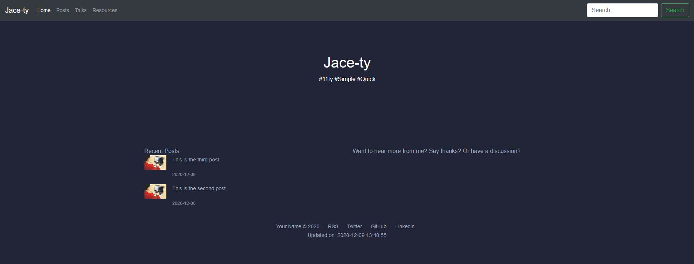

# Jace-ty

[](https://app.netlify.com/sites/jace-ty/deploys)

Jace's opinionated template for 11ty.

This project scaffold includes:

- [Eleventy](https://11ty.dev)
- [Syntax highlighting](https://github.com/jacebenson/jace-ty/blob/main/.eleventy.js#L21)
- [Simple Site Search](https://github.com/jacebenson/jace-ty/blob/main/src/_includes/base.njk) <sup>see searchPosts function</sup>
- [RSS](https://github.com/jacebenson/jace-ty/blob/main/.eleventy.js#L4)
- A folder structure for each post with proper passthrough for files
- [Comments](https://github.com/jacebenson/jace-ty/blob/main/src/_includes/layouts/post-single.njk#L56) powered by [https://utteranc.es/](https://utteranc.es/)




## Instructions

To get your own instance of this 11ty starter project cloned and deploying to Netlify click the button below and follow the instructions.

[](https://app.netlify.com/start/deploy?repository=https://github.com/jacebenson/jace-ty)

### Wait, what happens when I click that button?

Good question. Here's what it will do...

1. Netlify will clone the git repository of this project into your Github account. It will be asking for permission to add the repo for you.
2. We'll create a new site for you in Netlify, and configure it to use your shiny new repo. Right away you'll be able to deploy changes by pushing code to your repo.
3. That's it.

### Update `./src/_data/site.js` to have your details

This file controls some features of the site

They should all be self explanatory.  A call out I have is;

Utteranc.es requires the repository to be public on github to work

### Creating Posts

1. 11ty uses [collections](https://www.11ty.dev/docs/collections/), as such to make a post a draft, add a frontmatter line of `tags: "draft"`
2. This layout renders smaller images on the `/posts` page and in the footer.  There isn't anything to automatically resize you're images in this repo.  So you must have two images per post folder, `featured.jpg` and `featured-thumbnail.jpg` (keep 150px wide).  


## Prerequisites

- [Node and NPM](https://nodejs.org/)

## Running locally

```bash
# install the dependencies
yarn # or npm i # if you dont have yarn

# It will then be available locally for building with
yarn serve # or npm run serve if you dont have yarn
```